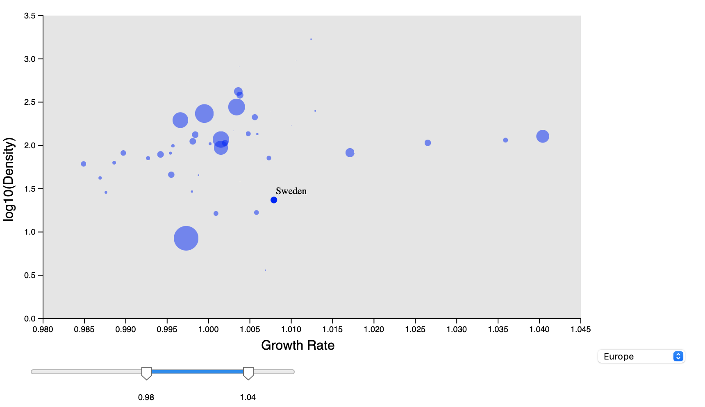
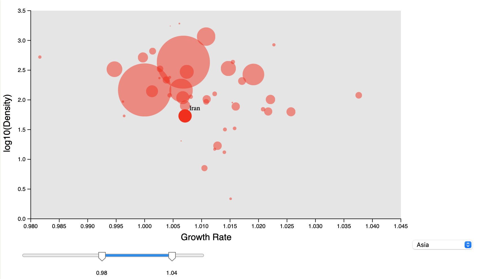
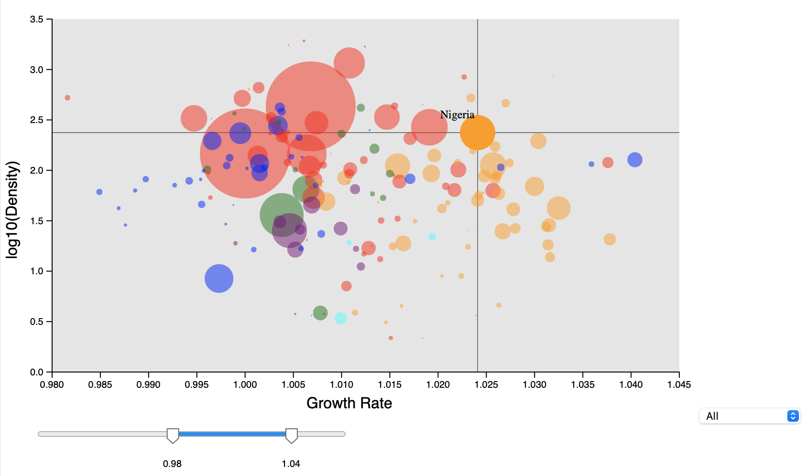

# Data Visualization Project

## Introduction

This project is a visualization of world population data. I used an interactive bubble chart to show the number of population, the population density and the population growth rate of each country. My goal is to allow the user to visualize both the macro distribution of population parameters for each country in the world as well as the differences between specific countries. It also enables users to learn about the demographic characteristics of each continent.

[Code in Vizhub](https://vizhub.com/GwentMasterShen/9aaea5c82a564afead882d4a64b96200)

## Data

The data I propose to visualize for my project is [World Population Dataset](https://www.kaggle.com/datasets/iamsouravbanerjee/world-population-dataset). In this Dataset, we have Historical Population data for every Country/Territory in the world by different parameters like Area Size of the Country/Territory, Name of the Continent, Name of the Capital, Density, Population Growth Rate, Ranking based on Population, World Population Percentage, etc.

## Questions & Tasks

The following tasks and questions will drive the visualization and interaction decisions for this project:

 * Which countries are the outliers in population growth rate and growth rate?
 * Is there a correlation among population, growth rate and density?
 * Whether countries on each continent will have particular population features?

## Sketches

Clicking on the bubble will take you to the detailed page of the country.

## Prototypes

According to the basic idea (x-axis to growth rate, y-axis to density, bubble size to population), I made [this very early prototype](https://vizhub.com/GwentMasterShen/9aaea5c82a564afead882d4a64b96200).

This prototype looks weird, almost all countries are at the bottom of the plot, because there is an outlier in density. It's a problem I have to solve. After that, I'll add a bunch of interactive parts, including filters that let the viewer adjust the range of the plot, a drop-down menu for selecting the country to be displayed on the plot, and mouse hovers and clicks.

## Milestones

* Complete a acceptable bubble chart.
* Add filter and drop-down menu.
* Complete the country detail page.
* Complete mouse clicking and hovering.

## Progress

* __Week 1:__
  1. Each bubble is colored to represent the country's continent. After being able to distinguish the continent to which each country belongs by its color, the user can simply see some phenomena, for example: African countries represented by yellow have a higher population growth rate compared to European countries represented by blue.
  2. To make the data more tightly distributed, I changed the values of the y-axis to log of the base 10 to the population density. This operation changes the range of the y-axis from 0 to 25000 to -1.5 to 4.5.
  3. I manually set the range of values for the x-axis and y-axis of the plot. These manipulations made the chart more readable. In future work, I will aim to make the adjusting range part of the interactive part(e.g. slider) for the viewer.

* __Week 2:__ This week I added a slider to allow the viewer to manually adjust the range of the x-axis by using a library "[d3-simple-slider](https://github.com/johnwalley/d3-simple-slider)". After the range of the x-axis has been adjusted, the new dataset is filtered to be shown on the plot according to the new range, and the range of the y-axis is automatically adjusted according to the maximum and minimum values of the new dataset. This feature helps the user to see more clearly the differences in demographic parameters between countries within a selected segment.

Full x-axis range.

Adjusted x-axis range.

* __Week 3:__ Inspired by the interactive color legend introduced in class, I added mouse hover interaction to the project this week. When the mouse is hovering over a circle, the circle will temporarily have 100% opacity and the name of the country represented by the circle will be displayed next to the mouse.

* __Week 4:__ This week I added a drop-down menu to my visualization that allows users to choose which continent's countries to display on the plot. This feature helps users focus on countries on a particular continent.

* __Week 5:__ I've made a few detail adjustments this week. Country names are displayed on the left side of the mouse when the mouse is on the right half of the chart, and on the right side of the mouse when the mouse is on the left half of the chart. This is to ensure that countries located on the edges also show the full name. I also added two lines that appear when the mouse is hovering over a circle to help the user better estimate the country's population parameter values.

## Conclusion and Future Works
In this project I used bubble chart to do data visualization of demographic parameters of each country in the world, where the x-axis represents the population growth rate, the y-axis represents the population density, the size of the circle represents the total population, and the color of the circle represents the continent in which it is located. I've also added sliders, drop-down menus, and mouse hovers as interactive features to help users adjust the focus of the plot and get more information. 

Despite adding a lot of interactive features, the amount of information is still limited. So in the initial prototype I designed detail pages for each country to show parameters such as age distribution of the population, gender distribution, and so on. However, this was not done in practice, so this became the future work of the project.The main challenges in this part at the moment are finding suitable and complete demographic data for each country, designing and building the detail pages, and switching between the main charts and pages.
