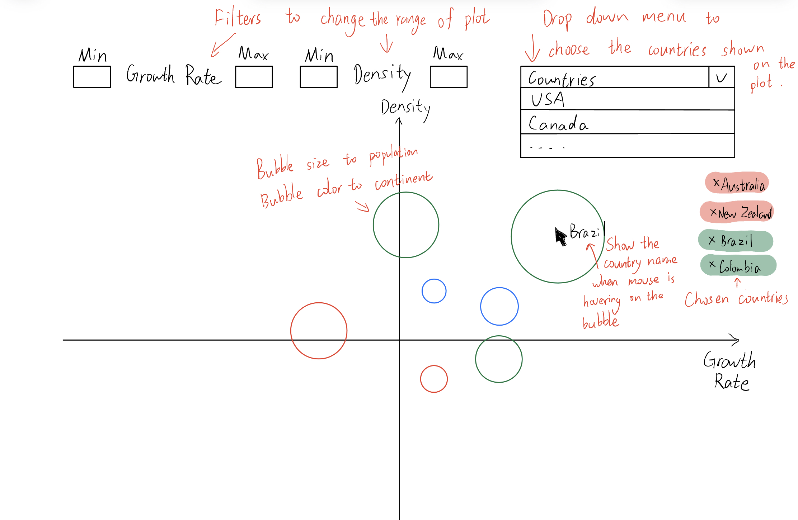
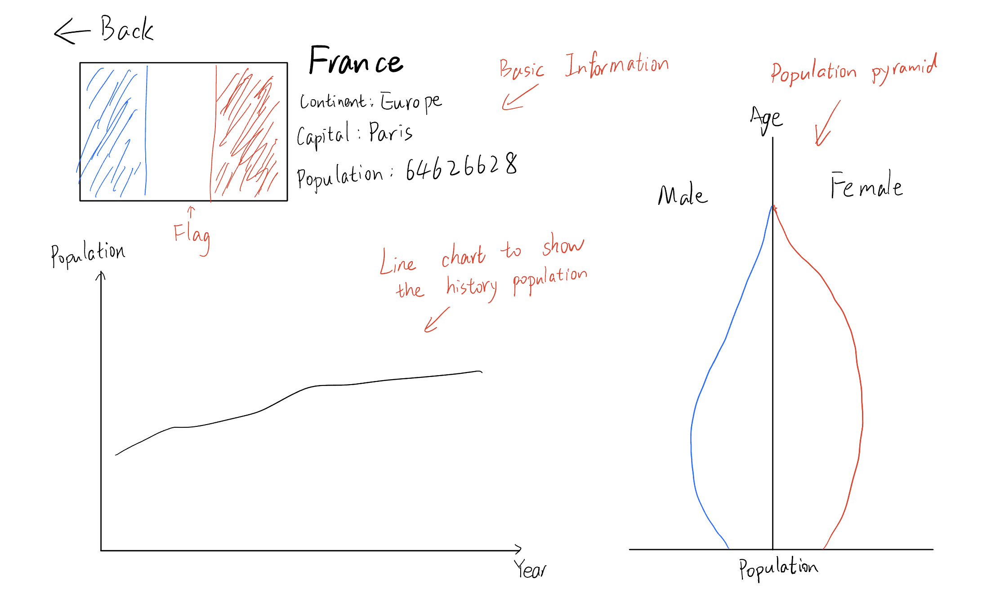
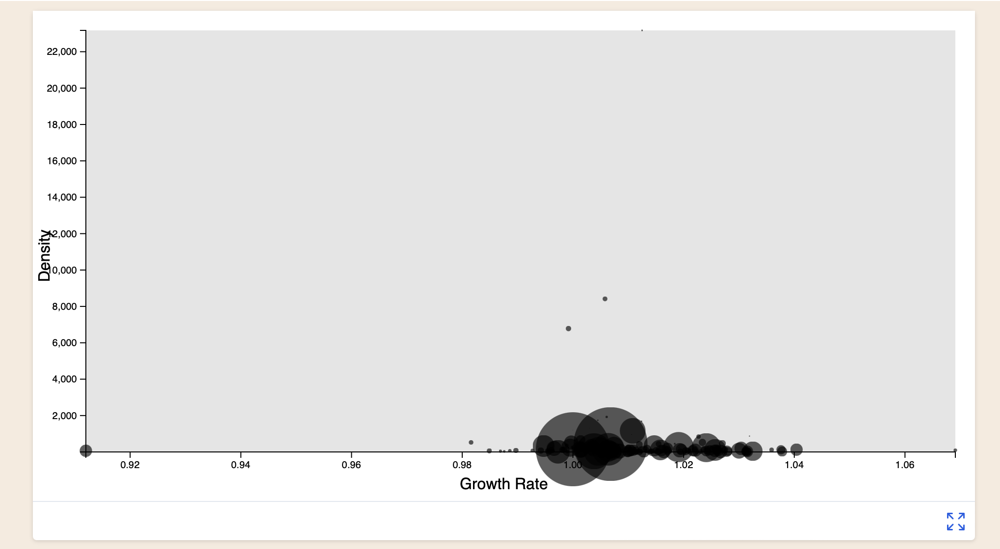
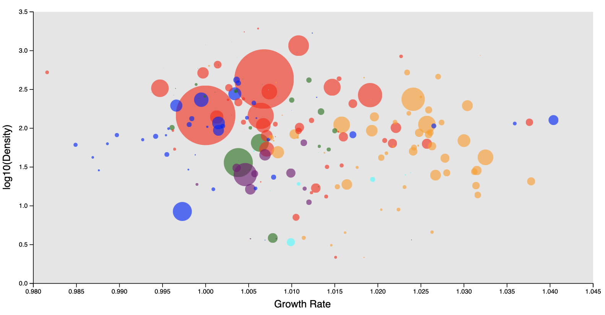
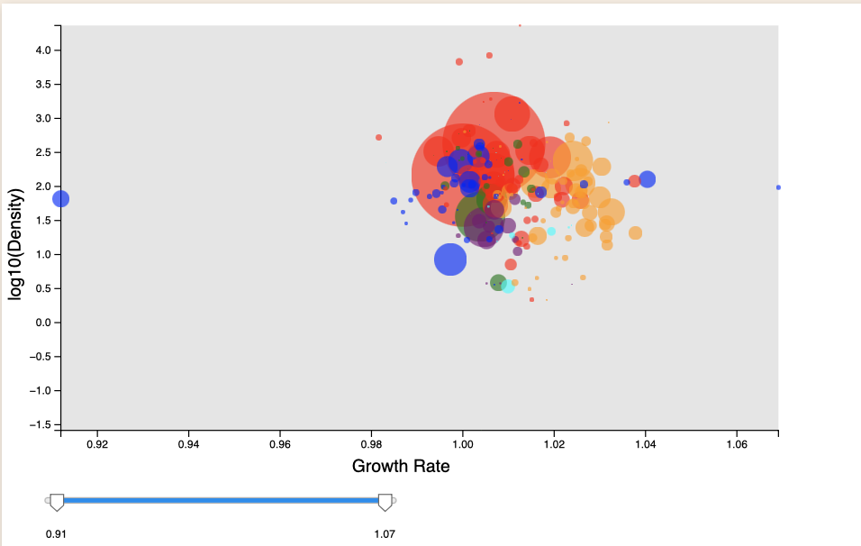
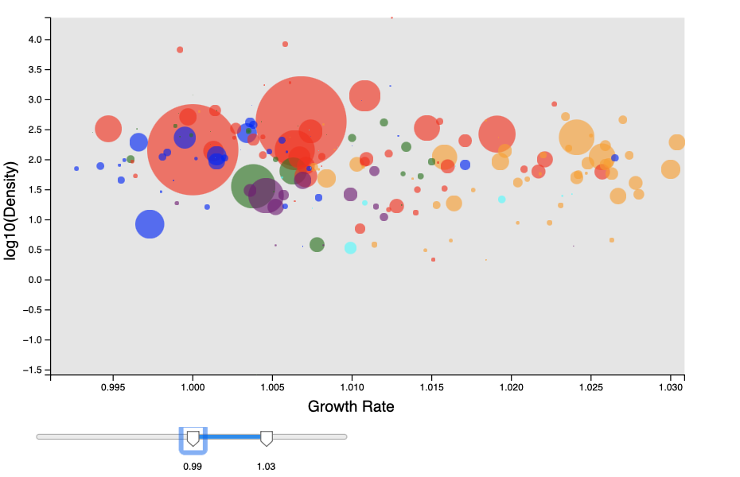
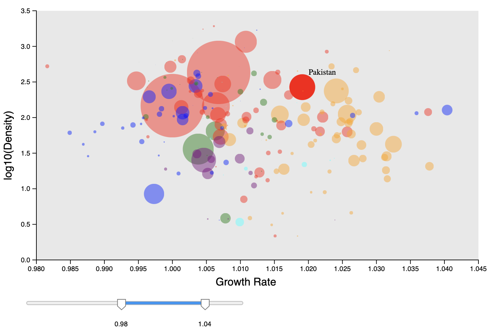

# Data Visualization Project

## Data

The data I propose to visualize for my project is [World Population Dataset](https://www.kaggle.com/datasets/iamsouravbanerjee/world-population-dataset). In this Dataset, we have Historical Population data for every Country/Territory in the world by different parameters like Area Size of the Country/Territory, Name of the Continent, Name of the Capital, Density, Population Growth Rate, Ranking based on Population, World Population Percentage, etc.

## Questions & Tasks

The following tasks and questions will drive the visualization and interaction decisions for this project:

 * Which countries are the outliers in population growth rate and growth rate?
 * Is there a correlation among population, growth rate and density?
 * Whether countries on each continent will have particular population features?

## Sketches

Clicking on the bubble will take you to the detailed page of the country.

## Prototypes

According to the basic idea (x-axis to growth rate, y-axis to density, bubble size to population), I made [this very early prototype](https://vizhub.com/GwentMasterShen/9aaea5c82a564afead882d4a64b96200).

This prototype looks weird, almost all countries are at the bottom of the plot, because there is an outlier in density. It's a problem I have to solve. After that, I'll add a bunch of interactive parts, including filters that let the viewer adjust the range of the plot, a drop-down menu for selecting the country to be displayed on the plot, and mouse hovers and clicks.

## Milestones

* Complete a acceptable bubble chart.
* Add filter and drop-down menu.
* Complete the country detail page.
* Complete mouse clicking and hovering.

## Progress

* __Week 1:__ Each bubble is colored to represent the country's continent. To make the data more tightly distributed, I changed the values of the y-axis to the logarithm of the population density. Additionally I manually set the range of values for the x-axis and y-axis of the plot. These manipulations made the chart more readable. In future work, I will aim to make the adjusting range part of the interactive part(e.g. slider) for the viewer. [(Code in Vizhub)](https://vizhub.com/GwentMasterShen/9aaea5c82a564afead882d4a64b96200)

* __Week 2:__ This week I added a slider to allow the viewer to manually adjust the range of the x-axis by using a library "[d3-simple-slider](https://github.com/johnwalley/d3-simple-slider)".

Full x-axis range.

Adjusted x-axis range.

* __Week 3:__ Inspired by the interactive color legend introduced in class, I added mouse hover interaction to the project this week. When the mouse is hovering over a circle, the circle will temporarily have 100% opacity and the name of the country represented by the circle will be displayed next to the mouse.

